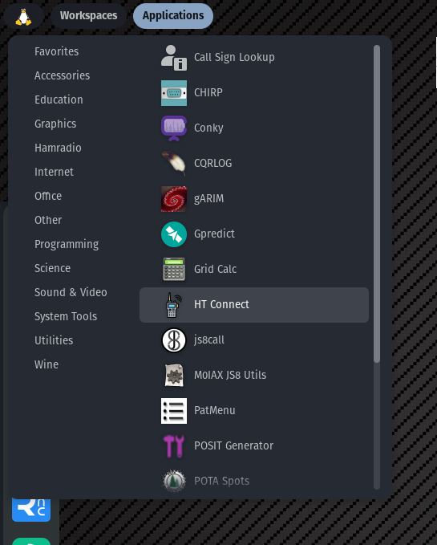
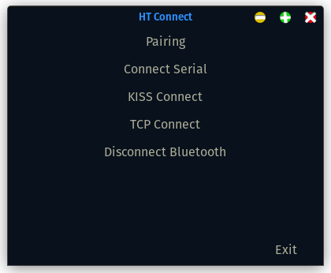

# HT-Connect

## Description

Ht-Connect is a bash script for linux that will allow you to connect your Btech UV-Pro or VGC VN76 to a device that is running linux.  The device could be a Raspberry Pi or any other computer running Linux that also has Bluetooth.  Once the ht is connected this will allow you to use the radio with other software on the the computer that supports using the ht's built-in KISS TNC.

**NOTE 
This script only automates the connecting of the HT to the computer over Bluetooth.  Once connected you will have to setup whatever software you are using to use the ht.  This script does NOT set up the software to work with the ht. It is not clear yet what all software these HT's will work with so try it out and Have fun.**


## Installing the HT-Connect

### Clone this repo

``` shell
get clone https://github.com/Dkane00/HT-Connect.git
```
#### Cd into HT-Connect folder
``` shell
cd HT-Connect
```
#### Run the install
``` shell
./install-ht-connect.sh
```

## How to Use

### GUI
THERE IS NOW A GUI FOR HT CONNECT!!!

The install script above will install a menu item in the menu on your desktop under the catagory HamRadio. Of course the menu item is called HT Connect!
When HT Connect is ran you will be prompted for your users sudo password and then a Gui menu will be displayed on your screen you can pair and connect your HT in any of the supported ways simply by selecting the thing you want to do from the on screen menu and everything is taken care of for you.  The selections on the menu are pairing, connect to rfcomm, connect to kiss, connect to tcp, and disconnect.  The disconnect will stop any proccesses that were started by the application to connect the radio, disconnect the radio from bluetooth, and even turn bluetooth off if you want it too.

screen shots:

menu item:




HT Connect main menu:




### Terminal Commands
- htc --help
  - This will give you this list of commands and what they do 

- htc pair
  - This command will will scan for Bluetooth devices and give you a list of found devices of which it will connect the one that you select. 

- htc connect
  - This command will connect an already paired ht to a rfcomm serial port on your computer that can then be used to interface the radio with software on your computer that will work with rfcomm serial ports.

- htc tcp
  - This command will connect an already paired ht to a rfcomm serial port and then connect that rfcomm serial port to a tcp port using socat. This makes the tnc available on the local computer through a local tcp network port.  This can be used to attach the Bluetooth TNC in the ht to ham radio software through a local tcp connection and allows the use of these ht's with software that may not support rfcomm serial ports or to standardize how software connects to different radios or tnc's

- htc kiss
  - This command will connect an already paired ht to a rfcomm serial port and then attach that serial port to the native linux ax25 system using kissattach. This makes it possible to use the Bluetooth tnc with the native ax25 system built into linx allowing the use of some ax25 packet applications that can use the linux native ax25 system.

- htc disconnect
  - This command will diconnect the radio from any of the above connected services. After running this the radio will be fully disconnected from the computer but will remain in the paired device list so that it can be reconnected at a later time without having to pair the radio again.

## **Note**
**Durring testing after disconnecting the radio from the computer the radio would have to be turned off and back on before reconnecting the radio to the computer using any of the connection types.**

